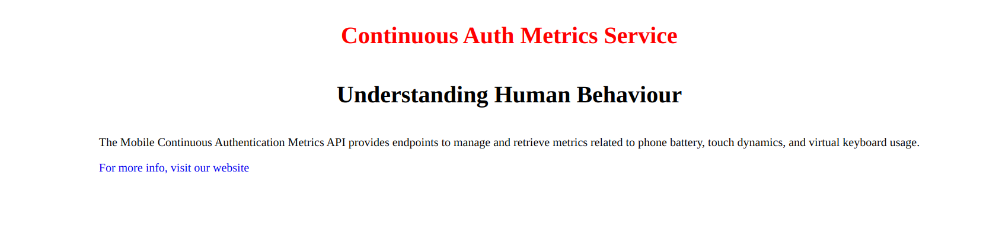

# Mobile Continuous Authentication Metrics API

## Introduction

The  Mobile Continuous Authentication Metrics API provides endpoints to manage and retrieve metrics related to phone battery, touch dynamics, and virtual keyboard usage.

## Base URL

All endpoints are prefixed with the base URL: `http://127.0.0.1:8000/api`

## Endpoints

### Battery Metrics

#### Routes for Battery Metrics for a Phone

- **URL:** `POST /battery-metrics/create`
- **Description:** Inserts battery metrics for a specific phone.
- **Parameters:**
  - `{device_id}`: The device id of the phone. 
  - `{android_version}`: The android version of the phone. 
  - `{voltage}`: The voltage of the phone. (Must be a number)
  - `{current}`: The current of the phone. (Must be a number)
- **Response:**
  - Status Code: 200 OK
  - Body: message and an object of the inserted metrics

- **URL:** `GET /battery-metrics`
- **Description:** Get a list of battery metrics.
- **Parameters:**
  - No paramaters needed
- **Response:**
  - Status Code: 200 OK
  - Body: Array of battery metrics.

- **URL:** `GET /battery-metrics/{device_id}`
- **Description:** Get a list of battery metrics for a specific phone.
- **Parameters:**
  - `{device_id}`: The device id of the phone.
- **Response:**
  - Status Code: 200 OK
  - Body: Array of battery metrics.


### Touch Dynamics

#### Routes for Touch Dynamics Metrics

- **URL:** `POST /touch-dynamics/create`
- **Description:** Inserts touch dynamics metrics for a specific phone.
- **Parameters:**
  - `{device_id}`: The device id of the phone. 
  - `{android_version}`: The android version of the phone. 
  - `{finger_pressure}`: The voltage of the finger pressure. (Must be a number)
  - `{finger_blocked_area}`: The value of finger blocked area. (Must be a number)
  - `{hold_time}`: The value of hold time. (Must be a number)
  - `{finger_orientation}`: The finger orientation value. 

- **Response:**
  - Status Code: 200 OK
  - Body: message and an object of the inserted metrics

- **URL:** `GET /touch-dynamics`
- **Description:** Get a list of touch dynamics metrics.
- **Parameters:**
  - No paramaters needed
- **Response:**
  - Status Code: 200 OK
  - Body: Array of touch dynamics.

- **URL:** `GET /touch-dynamics/{device_id}`
- **Description:** Get a list of touch dynamics metrics for a specific phone.
- **Parameters:**
  - `{device_id}`: The device id of the phone.
- **Response:**
  - Status Code: 200 OK
  - Body: Array of touch dynamics.

### Virtual Keyboard Metrics (Keystroke dynamics)

#### Routes for Virtual Keyboard Dynamics Metrics

- **URL:** `POST /virtual-keyboard-metrics/create`
- **Description:** Inserts virtual keyboard dynamics metrics for a specific phone.
- **Parameters:**
  - `{device_id}`: The device id of the phone. 
  - `{android_version}`: The android version of the phone. 
  - `{flight_time}`: The voltage of the flight time. (Must be a number)
  - `{key_hold_time}`: The value of key hold time. (Must be a number)
  - `{finger_pressure}`: The value of finger pressure. (Must be a number)
  - `{finger_area}`: The value of finger area. (Must be a number)

- **Response:**
  - Status Code: 200 OK
  - Body: message and an object of the inserted metrics

- **URL:** `GET /virtual-keyboard-metrics`
- **Description:** Get a list of virtual keyboard dynamics metrics.
- **Parameters:**
  - No paramaters needed
- **Response:**
  - Status Code: 200 OK
  - Body: Array of touch dynamics.

- **URL:** `GET /virtual-keyboard-metrics/{device_id}`
- **Description:** Get a list of virtual keyboard dynamics metrics for a specific phone.
- **Parameters:**
  - `{device_id}`: The device id of the phone.
- **Response:**
  - Status Code: 200 OK
  - Body: Array of virtual keyboard dynamics.


### Phone Metrics

#### Routes for Phone Metrics

- **URL:** `GET /phones`
- **Description:** Get a list of phones and their metrics (battery, touch dynamics and keystrokes).
- **Parameters:**
  - No paramaters needed
- **Response:**
  - Status Code: 200 OK
  - Body: Array of touch dynamics.

- **URL:** `GET /phones/{device_id}`
- **Description:** Get a specific phone and its metrics.
- **Parameters:**
  - `{device_id}`: The device id of the phone.
- **Response:**
  - Status Code: 200 OK
  - Body: Array of metrics for a specific phone.


# How to setup the Application

 This guide will help you set up this project on your local machine.

## Prerequisites

Make sure you have the following installed on your machine:

- [PHP](https://www.php.net/) (>= 8.2)
- [Composer](https://getcomposer.org/)
- [MySQL](https://www.mysql.com/) database

## Getting Started

1. **Clone the repository:**

    ```bash
    git clone https://github.com/DallingtonAsin/biometrics-api.git
    ```

2. **Navigate to the project directory:**

    ```bash
    cd biometrics-api
    ```

3. **Install PHP dependencies:**

    ```bash
    composer install --ignore-platform-reqs
    ```

4. **Copy the `.env.example` file to create a new `.env` file:**

    ```bash
    cp .env.example .env
    ```

## Configuration

Open the `.env` file in your favorite text editor and configure the following:

- `DB_CONNECTION`: Set it to `mysql`.
- `DB_HOST`: Database host (e.g., `127.0.0.1` for local development).
- `DB_PORT`: Database port (usually `3306`).
- `DB_DATABASE`: Database name.
- `DB_USERNAME`: Database username.
- `DB_PASSWORD`: Database password.

## Database Setup

Run the following commands to set up the database:

  ```bash
     php artisan migrate
  ```

## Run the Application
Start the development server using the command below

  ```bash
     php artisan serve
  ```

Visit http://localhost:8000 in your browser to confirm the application is running.



